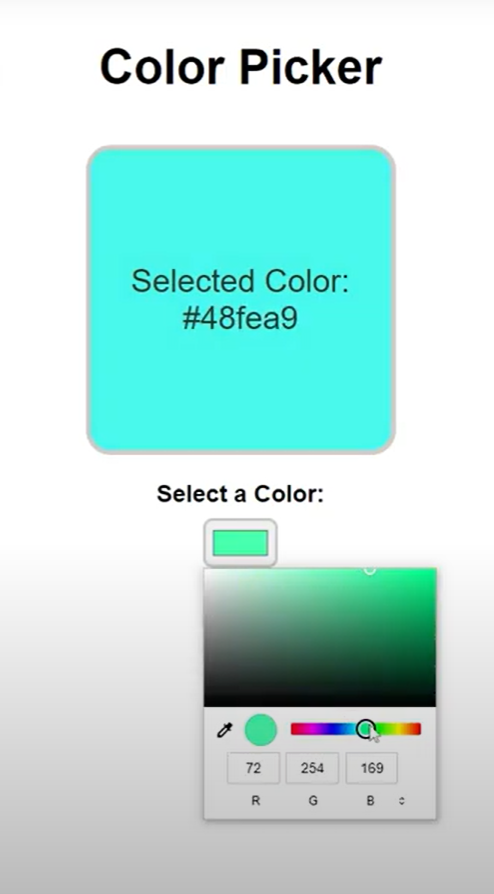

# Color Picker Project

This is a simple color picker that allows you to choose any color and display the selected color's value in different formats (RGB, HSL, and Hex). Additionally, the background color changes to the selected color, and the font color adjusts for better readability based on the luminance of the selected color.

### Mockup Reference:

The design and functionality of this project were inspired by a simple, intuitive color picker mockup. The mockup is a user-friendly interface that allows you to pick colors and view their RGB, HSL, and Hex values, with the added feature of adjusting font color for better readability.

### Learning Objectives:

- Learn how to implement a color picker with dynamic color adjustments.
- Understand how to calculate luminance to ensure text readability based on background color.
- Work with multiple color formats (RGB, HSL, and Hex) and display them dynamically.
- Explore responsive design techniques using relative units (`rem`) to ensure the interface adapts to different screen sizes.
- Gain experience in making the UI stylish and functional with modern CSS techniques.

### Final Result:

The final implementation is live and accessible via GitHub Pages:
[Access Color Picker](<GitHub Pages link>)

### Features:

- **Color Initialization:** The color picker initializes with a default color of `#000000` (black) or `rgb(0, 0, 0)`.
- **Multiple Color Formats:** The color is set by default in **RGB** format, but you can easily switch between RGB, HSL, and Hex formats using the color selector.
- **Hex Code Display:** Once a color is selected, the text `Selected Color: #hexcode` is displayed in the center of the color display area.
- **Font Color Adjustment:** The font color will change to white when the background color becomes dark enough, ensuring that the text remains readable. This is done by calculating the luminance of the selected color.
- **Responsive Design:** The layout uses relative units (`rem`) to ensure that it adjusts to various screen sizes.
- **Stylish Design:** The color display and color input have subtle shadow effects to give the interface a sleek, modern look.

### Feedback and Contributions:

Feedback is welcome! Feel free to open issues or submit pull requests to suggest improvements or report any bugs.

------

**Author**: Mabel Rincon